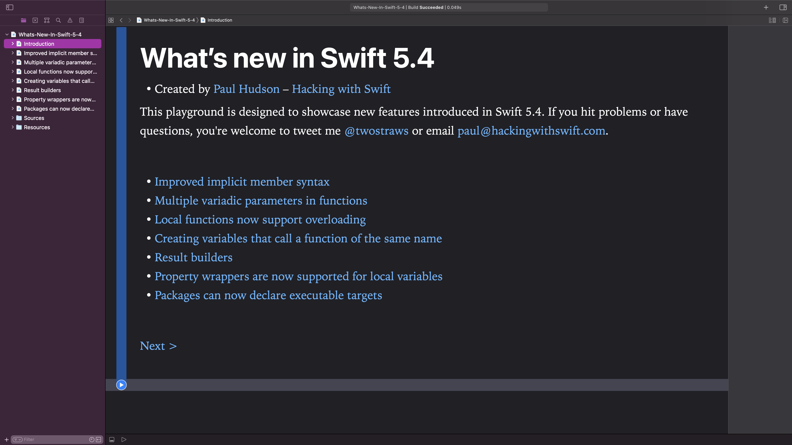

# What’s new in Swift 5.4?

This is an Xcode playground that demonstrates the new features introduced in Swift 5.4: 

* Improved implicit member syntax
* Multiple variadic parameters in functions
* Creating variables that call a function of the same name
* Result builders
* Local functions now support overloading
* Property wrappers are now supported for local variables
* Packages can now declare executable targets

This is designed to complement my existing article [What’s New in Swift 5.4](https://www.hackingwithswift.com/articles/228/whats-new-in-swift-5-4). You might also want to read [What’s New in Swift 5.3](https://www.hackingwithswift.com/articles/218/whats-new-in-swift-5-3), [What’s New in Swift 5.2](https://www.hackingwithswift.com/articles/212/whats-new-in-swift-5-2) and [What’s New in Swift 5.1](https://www.hackingwithswift.com/articles/182/whats-new-in-swift-5-1).

Alternatively, I have a whole website dedicated to tracking [what's new in Swift](https://www.whatsnewinswift.com) – you should check it out at <https://www.whatsnewinswift.com>.

If you hit problems or have questions, you're welcome to tweet me [@twostraws](https://twitter.com/twostraws) or email <paul@hackingwithswift.com>.

